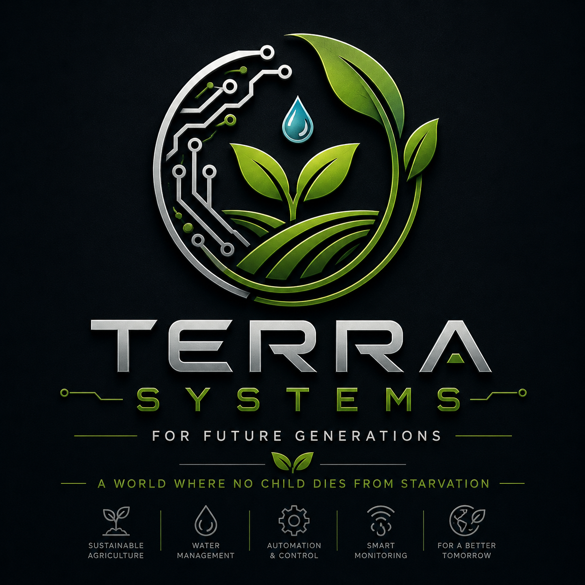

# TerraSystems

### FOR FUTURE GENERATIONS

**A World Where No Child Dies from Starvation**

---

## 🌱 About TerraSystems

TerraSystems is an open-source, continuously evolving platform for intelligent agricultural automation.

The current platform is built around Arduino-based embedded systems, modular sensors, actuators, environmental monitoring, water management, and real-time control.

The architecture is designed to grow continuously. New sensors, devices, programs, and automation modules are added as the project evolves, providing a flexible foundation for future agricultural systems.

### 🔧 Current Systems

- Arduino-based embedded control
- Modular sensor architecture
- DHT11 temperature and humidity monitoring
- Ultrasonic distance sensing
- Infrared communication
- Motion sensing
- Audio sensing
- Water pump and reverse-pump control
- Relay control
- LCD-based system interface
- LED status indicators
- Buzzer and system audio feedback
- Program-based system architecture
- Real-time hardware control

### 🚀 Future Development

TerraSystems is continuously expanding toward more advanced agricultural automation, including:

- Smart irrigation
- Water and nutrient management
- Advanced environmental monitoring
- Connected IoT systems
- Autonomous control
- Robotics
- Computer vision
- Artificial intelligence
- Machine learning
- Data-driven agriculture

The long-term vision is to build scalable and accessible technologies that improve agricultural efficiency, sustainability, and food production for future generations.

---

## ⚠️ IMPORTANT — LICENSE & COMMERCIAL USE

### 🚨 READ THE LICENSE BEFORE USING THIS PROJECT

**THIS PROJECT IS NOT PROVIDED FOR COMMERCIAL USE.**

TerraSystems is distributed under the **TerraSystems Non-Commercial License**.

---

## License Restrictions

You may use, study, modify, and distribute this project for personal, educational, research, experimental, and other non-commercial purposes.

**COMMERCIAL USE IS STRICTLY PROHIBITED WITHOUT PRIOR WRITTEN PERMISSION.**

This includes, but is not limited to:

- ❌ Selling this software or modified versions
- ❌ Selling hardware or products based on this project
- ❌ Using this software in a commercial product
- ❌ Using this software in a commercial agricultural system
- ❌ Using this software to provide paid services
- ❌ Using this project for commercial automation or deployment
- ❌ Including this project in a product offered for sale
- ❌ Redistributing this project for commercial purposes
- ❌ Monetizing software or systems substantially based on this project
- ❌ Using this project on behalf of a commercial customer

---

## ✅ Permitted Uses

- ✅ Personal projects
- ✅ Hobby projects
- ✅ Educational projects
- ✅ University and student projects
- ✅ Academic research
- ✅ Experimental development
- ✅ Private testing
- ✅ Studying and inspecting the source code
- ✅ Modifying and improving the source code
- ✅ Sharing non-commercial modifications
- ✅ Creating tutorials and educational material

---

## 💼 Commercial Licensing

Commercial use is possible only with explicit prior written permission from **TerraSystems / Reverse-A**.

If you intend to use TerraSystems in a commercial product, commercial agricultural system, paid service, business operation, or any other activity involving financial gain, you must obtain a separate commercial license before doing so.

> **DO NOT ASSUME THAT PUBLICLY AVAILABLE SOURCE CODE IS FREE FOR COMMERCIAL USE.**

> **PUBLIC ACCESS TO THIS REPOSITORY DOES NOT GRANT COMMERCIAL RIGHTS.**

By using, copying, modifying, or distributing this project, you agree to comply with the license file included in this repository.

---

**TerraSystems**

*For Future Generations.*

**A World Where No Child Dies from Starvation.**

